# Heart Failure Prediction using Azure Machine Learning
---
## Project Overview
This project demonstrates the implementation of machine learning workflows using Microsoft Azure Machine Learning Studio to predict heart failure events based on clinical patient data.
Two different machine learning approaches were implemented and compared during this project:
 - HyperDrive with Logistic Regression
 - Automated Machine Learning (AutoML)
   
The objective of the project was to compare both approaches using the AUC metric, identify the best-performing model, register the trained model, and deploy the final model as an online endpoint for real-time inference.

The project also demonstrates several Azure ML capabilities including:
- Dataset management
- Hyperparameter tuning
- Automated Machine Learning
- Azure ML Pipelines
- Model registration
- Online endpoint deployment
- Experiment tracking and monitoring

Project Architecture

 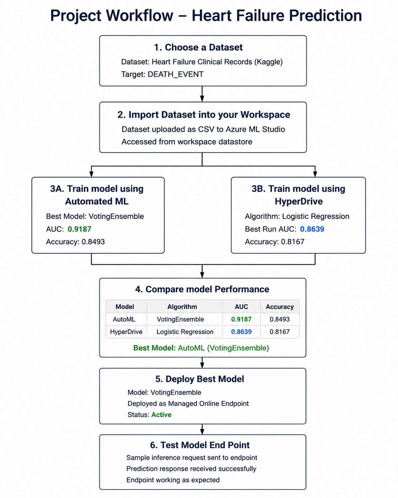 

The architecture above illustrates the overall machine learning workflow implemented inside Azure Machine Learning Studio.

Compute Cluster
A CPU-based compute cluster was created and used to run all machine learning experiments, including:
-	HyperDrive runs
-	AutoML experiments
-	Pipeline execution
-	Model training and evaluation
    
Azure Machine Learning automatically managed the cloud resources during execution.

 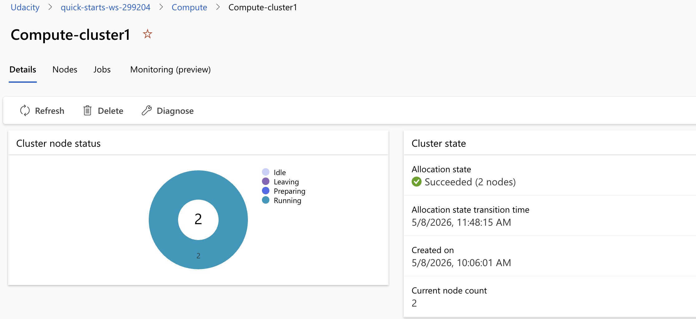 

## Dataset
The dataset used in this project is the Heart Failure Clinical Records dataset.
Dataset source:
Heart Failure Clinical Records Dataset - Kaggle
The dataset contains medical and clinical information collected from heart failure patients and is used to predict whether a patient is likely to experience a heart failure event.
The target column used for prediction is:
 - DEATH_EVENT
   
Some of the important features included in the dataset are:
-	age
-	anaemia
-	diabetes
-	ejection_fraction
-	serum_creatinine
-	serum_sodium
-	smoking
-	high_blood_pressure

Dataset Upload to Azure ML
The dataset was downloaded externally from Kaggle in CSV format and then uploaded manually into Azure Machine Learning Studio.
After uploading the dataset into the Azure ML workspace, it was accessed inside the training scripts and used for both HyperDrive and AutoML experiments.

### Data Preprocessing
Several preprocessing steps were applied before training the machine learning models.
The preprocessing workflow included:
-	Loading the dataset using Pandas
-	Splitting the dataset into training and testing sets
-	Separating features and target labels
-	Feature scaling using StandardScaler
-	Preparing the dataset for Azure ML experiments
  
These preprocessing steps help improve model performance and training stability, especially for Logistic Regression.

---

## HyperDrive Experiment

### HyperDrive Overview
HyperDrive was implemented to automate hyperparameter tuning for the Logistic Regression model.
Instead of manually testing different parameter combinations, Azure ML automatically generated multiple child runs using different hyperparameter values and evaluated each run using the AUC metric.
The objective was to identify the best training configuration while improving model performance.

RandomParameterSampling was used to explore the hyperparameter search space efficiently. This approach helps reduce unnecessary computation while still testing multiple parameter combinations.

The following hyperparameters were optimized:

- **C**
- **max_iter**

### Hyperparameter Search Space

The HyperDrive experiment tuned at least two different hyperparameters for the Logistic Regression model.

| Parameter | Description | Search Range |
|-----------|-------------|--------------|
| C | Regularization strength | 0.1 → 1.0 |
| max_iter | Maximum training iterations | 100 → 300 |

These ranges were selected to balance training stability, convergence speed, and model generalization performance.

### HyperDrive Runs

Azure Machine Learning tracked multiple child runs during the HyperDrive experiment. The following screenshots show the run progress, AUC comparison, and the best-performing configuration.
  

 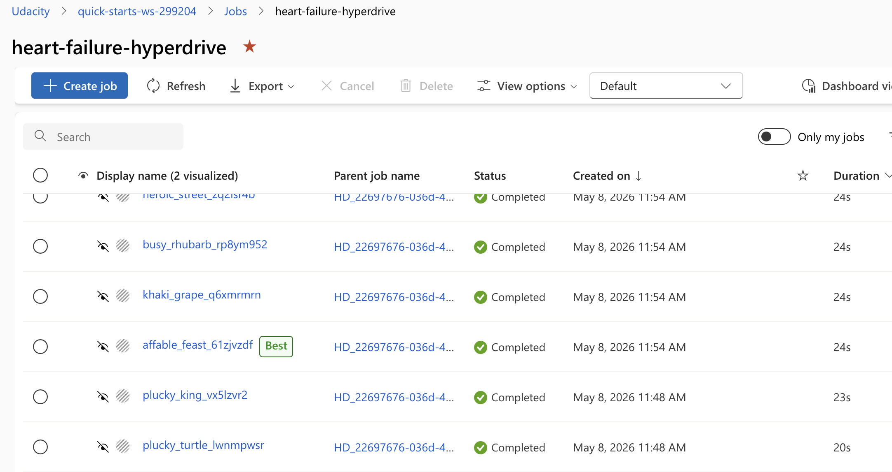 

## Best HyperDrive Run

The best HyperDrive run was selected automatically based on the AUC metric.

The selected run achieved the following results:

- Accuracy = 0.8167
- AUC = 0.8639

The best-performing configuration used:

- C = 0.2281488016307031
- max_iter = 300
  

 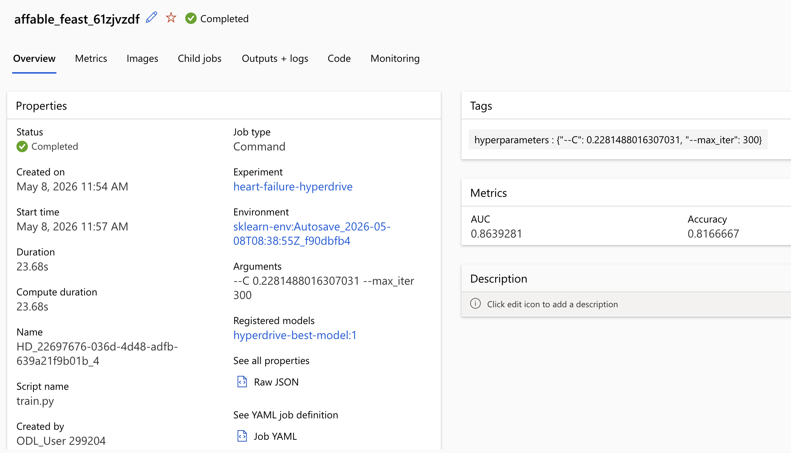 

### HyperDrive Metrics

Azure ML generated multiple metrics and visualizations for evaluating model performance.

 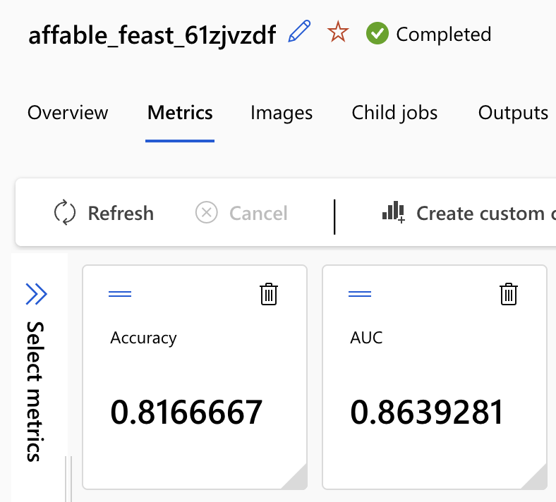 

The experiment demonstrated stable model performance with acceptable classification capability for predicting heart failure events.

HyperDrive Visualization
The visualization below shows the effect of different hyperparameter combinations on the AUC metric.

 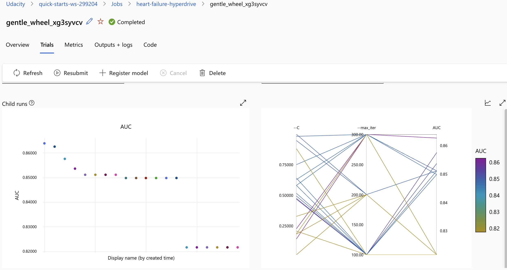 

This visualization helps analyze:
- Hyperparameter influence
- Trial performance
- AUC progression
- Best-performing configurations

HyperDrive Model Registration
After identifying the best-performing HyperDrive run, the trained model was registered successfully inside Azure Machine Learning Studio.
The registered model details include:
- Model Name: hyperdrive-best-model
- Version: 1
	

 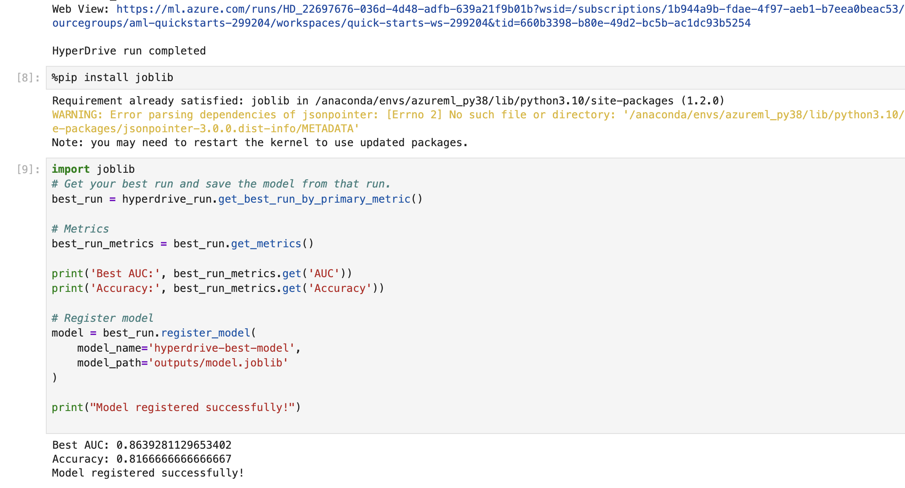 

---

## AutoML Experiment

### AutoML Overview

Automated Machine Learning (AutoML) was implemented to automatically evaluate multiple machine learning algorithms and identify the best-performing model. Unlike HyperDrive, which focuses on tuning one algorithm, AutoML tests several algorithms and preprocessing combinations automatically.
The objective was to determine whether AutoML could outperform the manually configured HyperDrive workflow.

### AutoML Experiment Configuration

The AutoML experiment was configured as a classification task to predict heart failure events using the `DEATH_EVENT` target column.

The primary evaluation metric was:

- AUC Weighted

Additional AutoML settings included:

- Cross-validation enabled
- Automatic featurization enabled
- Compute cluster execution
- Experiment timeout configuration

These settings allowed Azure ML to automatically evaluate multiple machine learning algorithms and preprocessing pipelines efficiently.

### AutoML Experiment Runs

Azure ML automatically generated multiple child runs using different machine learning algorithms and preprocessing pipelines.

 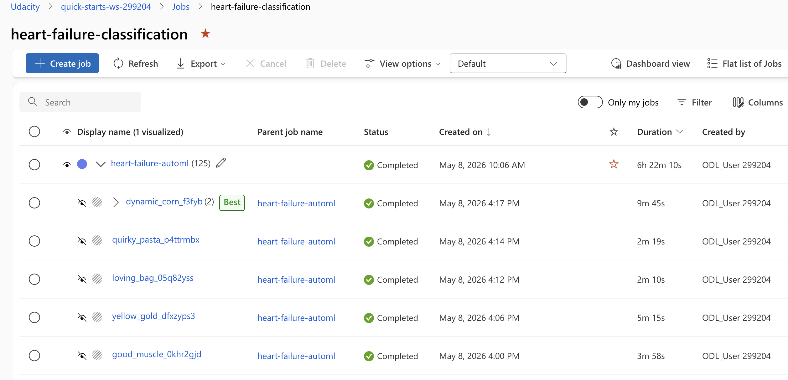 

### Best AutoML Model

The best-performing AutoML model was automatically selected based on the AUC metric.

The selected algorithm was:

- VotingEnsemble

The model achieved approximately:

- AUC Weighted = 0.9187
- Accuracy = 0.8493

 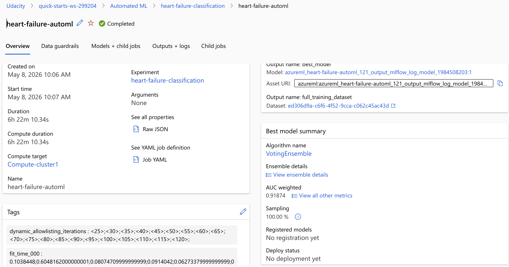 

### AutoML Metrics

Azure ML generated several evaluation metrics and visualizations for the AutoML experiment.

[Add AutoML metrics screenshot here]

Additional evaluation charts included:

- ROC Curve
- Precision-Recall Curve
- Calibration Curve
- Lift Curve
- Cumulative Gains Curve
- Confusion Matrix

 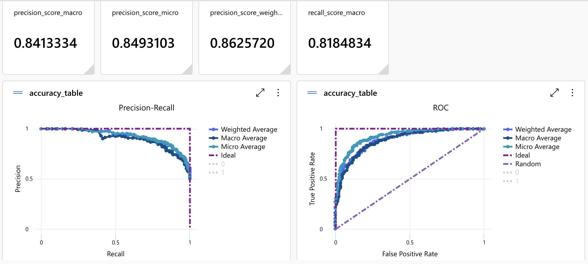 
 
 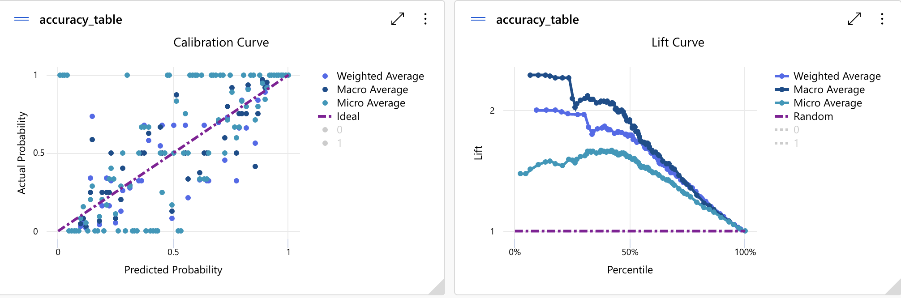 
 
 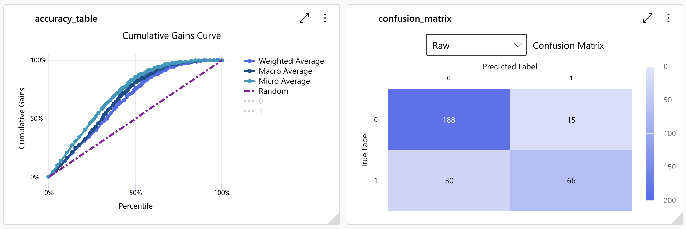 

---

### Model Comparison

The AUC metric was selected as the primary metric for comparing both machine learning approaches.

AUC is useful for classification problems because it measures how effectively the model distinguishes between positive and negative classes.

| Approach | Algorithm | AUC |
|---|---|---|
| HyperDrive | Logistic Regression | 0.8639 |
| AutoML | VotingEnsemble | 0.9187 |

The results show that the AutoML model outperformed the HyperDrive model in this project.

The VotingEnsemble model achieved better classification capability and stronger overall predictive performance.

---

## Azure ML Pipeline

### Pipeline Overview

An Azure ML Pipeline was created using `PythonScriptStep` to automate the training workflow inside Azure Machine Learning.

The pipeline executed the training script (`train.py`) directly on the Azure ML compute cluster.

Using Azure ML Pipelines helps improve:

- Workflow automation
- Reproducibility
- Experiment organization
- Scalability
- Resource management
  
### Pipeline Configuration

The pipeline was configured using:

- PythonScriptStep
- Azure ML SDK
- Azure ML Compute Cluster
- Custom training script (`train.py`)

The pipeline training step handled:

- Dataset loading
- Data preprocessing
- Model training
- Metric logging
- Saving model artifacts

### Pipeline Execution

The pipeline executed successfully inside Azure Machine Learning Studio.

Azure ML automatically tracked:

- Pipeline status
- Logs
- Outputs
- Metrics
- Execution duration

The following screenshots show the Azure ML pipeline workflow and successful execution status.

  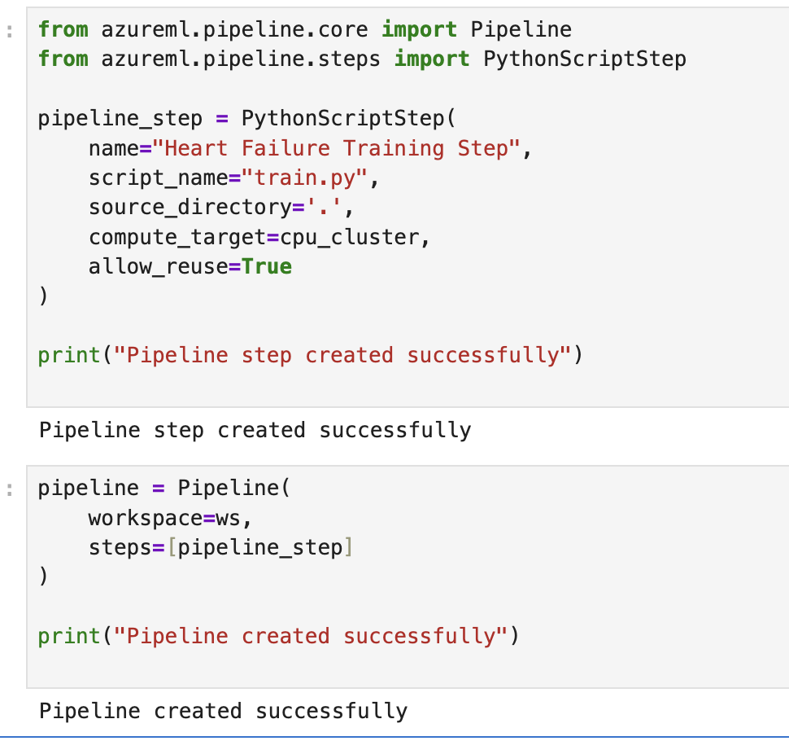

  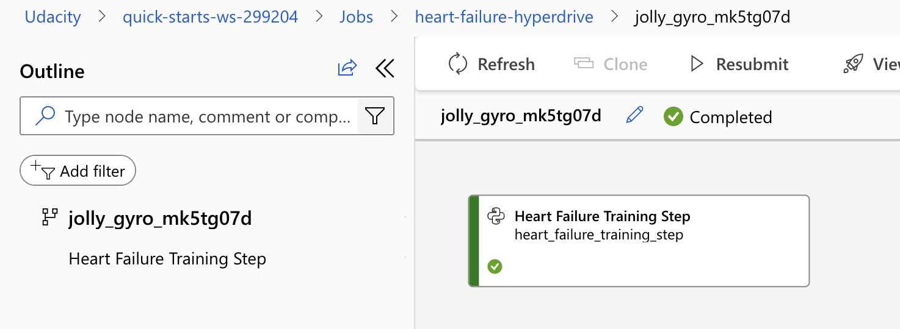

After deployment, the endpoint was tested using a sample inference request inside the Python notebook. The deployed model successfully returned a prediction response (`No`), confirming that the online endpoint was working correctly.

## Model Deployment

### Deployment Overview

The best-performing AutoML model was deployed successfully as a managed online endpoint in Azure Machine Learning.  
The deployment provides a REST API endpoint that can receive inference requests and return prediction results in real time.

### Endpoint Consumption

Azure ML automatically generated endpoint consumption details, including:
- REST endpoint URI
- Authentication keys
- Python inference example
- JSON request format

  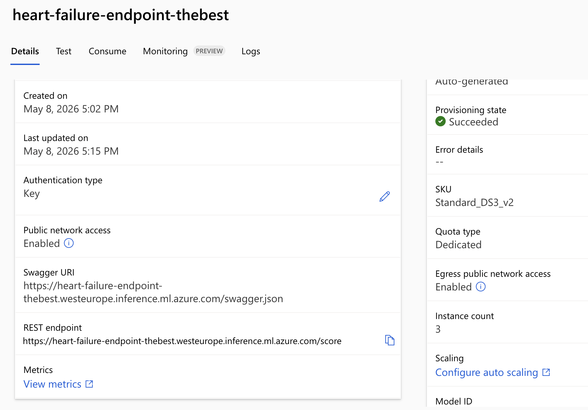
  &nbsp;&nbsp;&nbsp;
  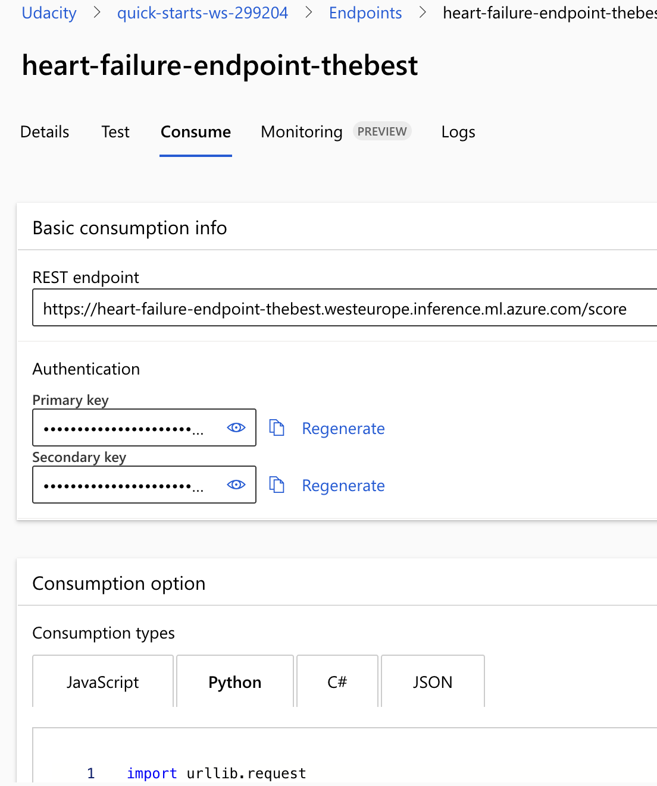

### Sample Inference Request

A sample inference request was sent successfully to the deployed endpoint to verify that the deployment was functioning correctly.

The endpoint returned a prediction result (`No`), confirming that the model deployment was active and operational.

 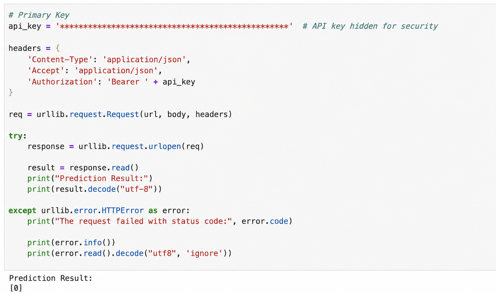 

## Registered Models

Both models were registered successfully inside Azure Machine Learning Studio.

Registered models:

- `hyperdrive-best-model`
- `heart-failure-votingensemble`

 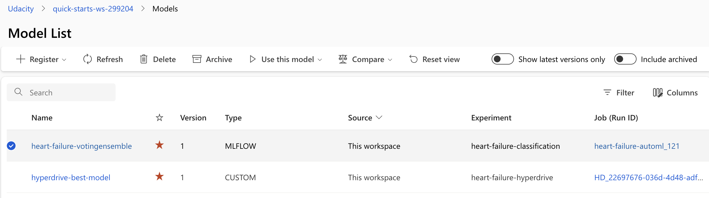 

### Resource Cleanup
After completing all experiments and deployments, compute resources can be stopped or deleted to avoid unnecessary cloud costs.
This follows cloud computing best practices for resource optimization and cost management.

---

## Future Improvements
Several improvements could further enhance this project in the future:
-	Testing additional machine learning algorithms
-	Applying advanced feature engineering techniques
-	ncreasing dataset size
-	Deploying monitoring solutions for production inference
-	Implementing automated retraining pipelines
-	Testing deep learning approaches
-	Improving endpoint scalability and monitoring

